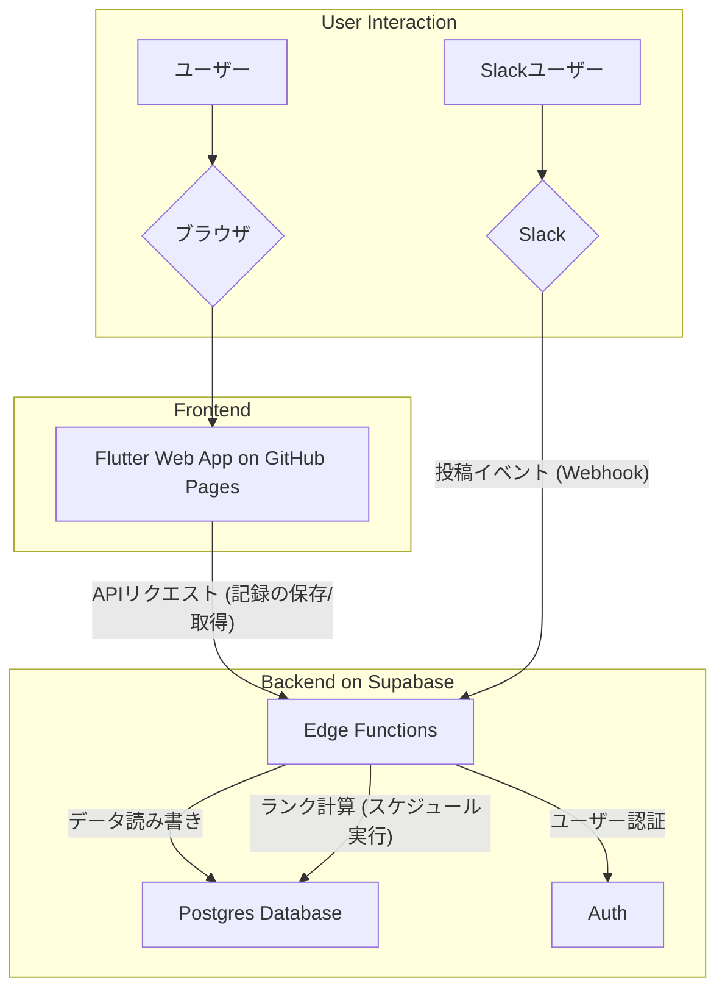

# トレーニング記録アプリ（仮）

## 1. 概要 (Overview)

**この資料に書かれた内容は設計段階のもので実装されていません。**

このアプリケーションは、トレーニングの記録を行い運動習慣化を促進することを目的とした Web アプリケーションです。

日々のトレーニングを手軽に記録し、Slack と連携することでトレーニングの記録がコミュニティで共有され、モチベーションの向上を目指します。

## 2. アーキテクチャ (Architecture)

本システムは、フロントエンドとバックエンドを明確に分離したモダンな Jamstack 構成を採用しています。

コード スニペット

## 3. 技術スタック (Technology Stack)

### フロントエンド

| 用途              | 技術             | 備考                                         |
| ----------------- | ---------------- | -------------------------------------------- |
| UI フレームワーク | **Flutter Web**  | iOS/Android アプリへの将来的な拡張性も考慮。 |
| ホスティング      | **GitHub Pages** | 静的サイトを無料で高速に配信。               |

### バックエンド

| 用途             | 技術                        | 備考                                             |
| ---------------- | --------------------------- | ------------------------------------------------ |
| プラットフォーム | **Supabase**                | バックエンド機能全般を提供。                     |
| データベース     | **PostgreSQL**              | Supabase のコア。信頼性の高いリレーショナル DB。 |
| 認証             | **Supabase Auth**           | Slack アカウントを利用した OAuth 認証。          |
| サーバーレス関数 | **Supabase Edge Functions** | ビジネスロジックの実行環境。                     |

### その他

| 用途             | 技術               | 備考                                                 |
| ---------------- | ------------------ | ---------------------------------------------------- |
| ソースコード管理 | **GitHub**         |                                                      |
| CI/CD            | **GitHub Actions** | `main`ブランチへのプッシュをトリガーに自動デプロイ。 |
| 連携サービス     | **Slack**          | 活動報告のハブ。Events API を利用。                  |

## 4. 各コンポーネントの詳細 (Component Details)

### Frontend (GitHub Pages)

- **役割**: ユーザーに対する UI を提供します。Flutter で開発し、静的な HTML/CSS/JS ファイルにビルドしたものを GitHub Pages でホスティングします。
- **機能**:
  - トレーニング記録の入力フォーム
  - 過去の記録の閲覧
  - 自身のランクや活動状況の表示

### Backend (Supabase)

- **役割**: アプリケーションのすべてのデータとビジネスロジックを管理します。
- **Database (PostgreSQL)**:
  - `users`: ユーザー情報と現在のランクを管理。
  - `training_records`: 全メンバーのトレーニング記録を蓄積。
- **Auth**:
  - Slack ログインを提供し、ユーザーを識別します。データベースの RLS（Row Level Security）と連携し、データへのアクセス制御を安全に行います。
- **Edge Functions**:
  - **Slack Webhook**: 設定で指定したSlack の特定のチャンネルへの投稿を検知し、内容を解析してデータベースに保存します。
  - **API**: Flutter アプリからのリクエスト（記録の作成・取得など）を処理します。
  - **スケジュール実行**: 1 日 1 回などの頻度で定期実行され、全ユーザーのランクを自動で再計算・更新します。

## 5. データフロー (Data Flow)

### 記録の投稿フロー

1. **アプリ経由**: ユーザーがアプリで記録を保存すると、Supabase の Edge Functions (API) が呼び出され、DB にデータが保存されます。
2. **Slack 直接投稿経由**: メンバーが Slack に投稿すると、Slack Events API が発火し、Supabase の Edge Functions (Webhook) を呼び出します。関数が投稿内容を解析し、DB にデータを保存します。

### ランク集計フロー

1. Supabase のスケジュールされた Edge Function が定期的に起動します。
2. `training_records`テーブルから全記録を読み込みます。
3. 各ユーザーのランクアップ/ダウン条件を判定します。
4. 変更があった場合、`users`テーブルのランク情報を更新します。

## 6. CI/CD

- GitHub リポジトリの`main`ブランチにプッシュ（またはマージ）されると、GitHub Actions が自動的に起動します。
- Flutter Web アプリのビルドが行われ、生成された静的ファイルで GitHub Pages が更新され、ユーザーは常に最新版のアプリケーションを利用できます。
