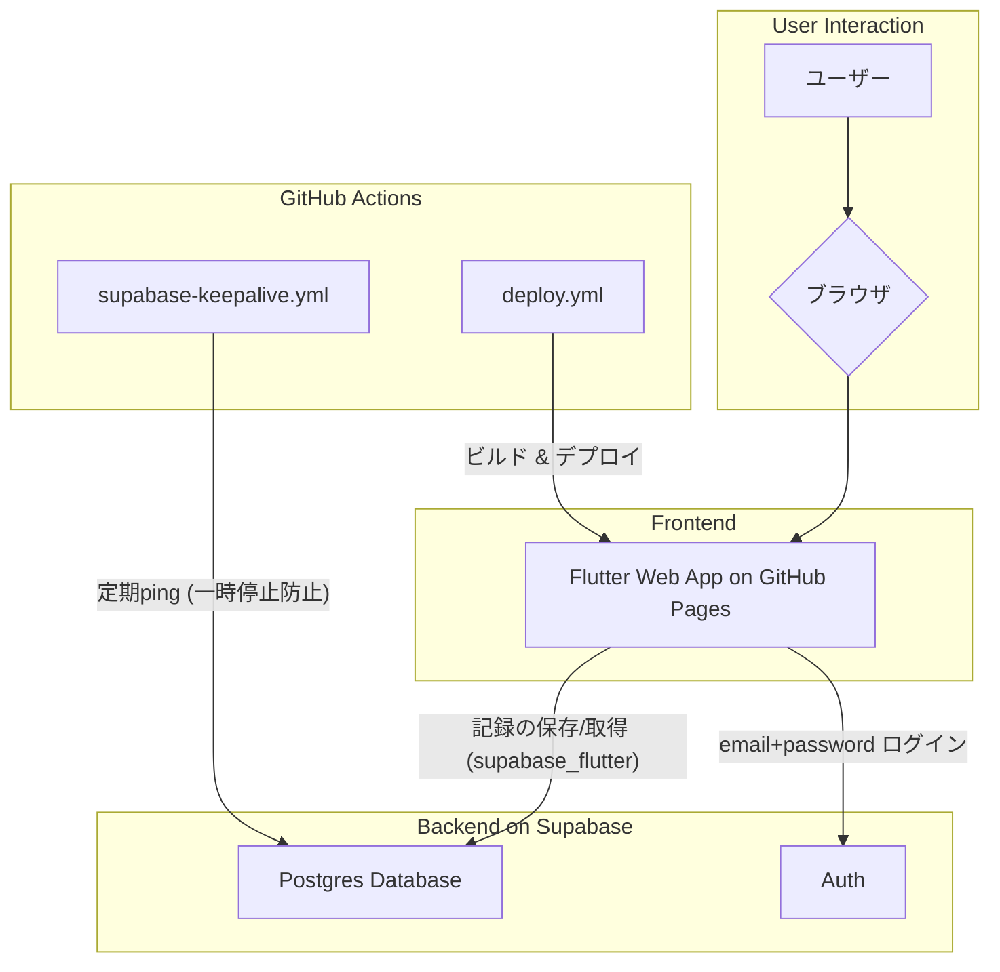

# トレーニング記録アプリ（仮）

## 1. 概要 (Overview)

このアプリケーションは、トレーニングの記録を行い運動習慣化を促進することを目的とした Web アプリケーションです。

日々のトレーニングを手軽に記録し、Slack と連携することでトレーニングの記録がコミュニティで共有され、モチベーションの向上を目指します。

この資料は「実装済みアーキテクチャ」と「将来構想（未実装）」の 2 部構成です。

## 2. 実装済みアーキテクチャ (Current Architecture)

フロントエンド（Flutter Web / GitHub Pages）とバックエンド（Supabase）を分離した構成を採用しています。

```mermaid
graph TD
    subgraph User Interaction
        A[ユーザー] --> B{ブラウザ};
    end

    subgraph Frontend
        B --> D[Flutter Web App on GitHub Pages];
    end

    subgraph Backend on Supabase
        F[Postgres Database];
        G[Auth];
    end

    D -- "記録の保存/取得 (supabase_flutter)" --> F;
    D -- "email+password ログイン" --> G;

    subgraph GitHub Actions
        H[deploy.yml];
        I[supabase-keepalive.yml];
    end

    H -- "ビルド & デプロイ" --> D;
    I -- "定期ping (一時停止防止)" --> F;
```

### Frontend (Flutter Web / GitHub Pages)

- **役割**: トレーニング記録の入力・閲覧 UI を提供する
- **データアクセス**: `TrainingRepository` インターフェースを介して永続化層にアクセスする。現在の実装は `SupabaseTrainingRepository`（クエリ構築は `TrainingRecordsApi` シームに分離しテスト可能にしている）
- **認証**: `AuthService` インターフェース + `AuthGate` により、ログイン状態に応じてログイン画面と一覧画面を切り替える。セッションは supabase_flutter が自動で永続化・復元する
- **Slack との関係**: 記録から Slack 投稿用の文言を生成しクリップボードへコピーする（投稿は手動）
- **データ移行**: 旧ローカル永続化（Hive/IndexedDB）の記録が端末に残っており、かつサーバーが空の場合のみ、確認のうえ一括移行する（`LocalDataMigrator`）。移行後のローカルデータは切り戻し用に残しており、本番での動作確認が済んだら Hive 関連コードごと撤去する予定

### Backend (Supabase)

- **Database (PostgreSQL)**: `training_records` テーブルに記録を保存する。RLS（Row Level Security）により所有者のみが読み書きできる。スキーマは `supabase/migrations/` で管理する
- **Auth**: email+password のログインのみ有効化し、サインアップは無効（ダッシュボードで作成した単一ユーザーのみが利用できる）
- **接続情報**: Project URL と Publishable key（RLS 前提の公開可能キー）をビルド時に `--dart-define` で注入する

セットアップ手順は [supabase/README.md](../supabase/README.md) を参照。

### CI/CD (GitHub Actions)

- **deploy.yml**: `main` へのプッシュでビルドし GitHub Pages へデプロイする。Supabase の接続情報はリポジトリ Variables から注入する
- **supabase-keepalive.yml**: Supabase Free プランの一時停止（約 1 週間の非アクティブで発生）を防ぐため、週 2 回 REST API へアクセスする

## 3. 将来構想 (Future Vision) ※未実装

以下は要求（`docs/requirements.md`）に基づく構想であり、現在の実装には含まれていません。

- **マルチユーザー化**: Supabase Auth の Slack OAuth によるログインを追加し、RLS ポリシーを緩和してメンバー同士の記録閲覧を可能にする。`users` テーブルでユーザー情報とランクを管理する
- **ランクの自動更新**: 記録からランク（準会員〜マスター）を自動計算する。判定条件（週の定義・継続判定・降格ルール）の詳細化が必要
- **Slack 連携の自動化**: 現在は文言生成+手動コピペ。自動投稿や Slack 投稿の自動取り込み（Events API）は一旦白紙とし、必要になった時点で方式を再検討する
